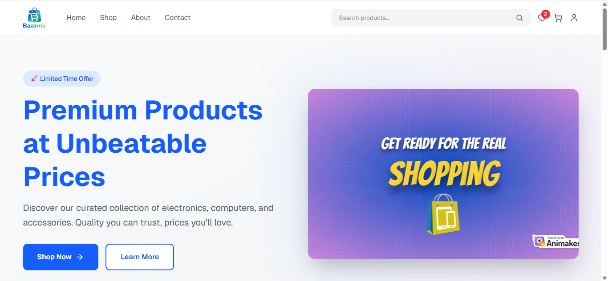
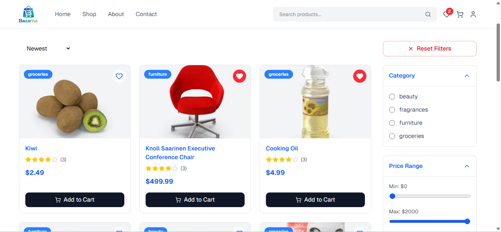
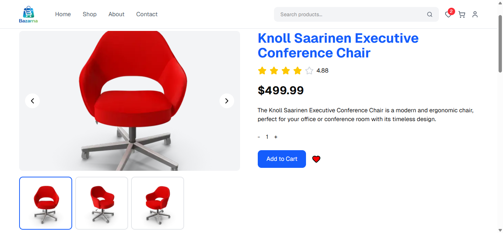
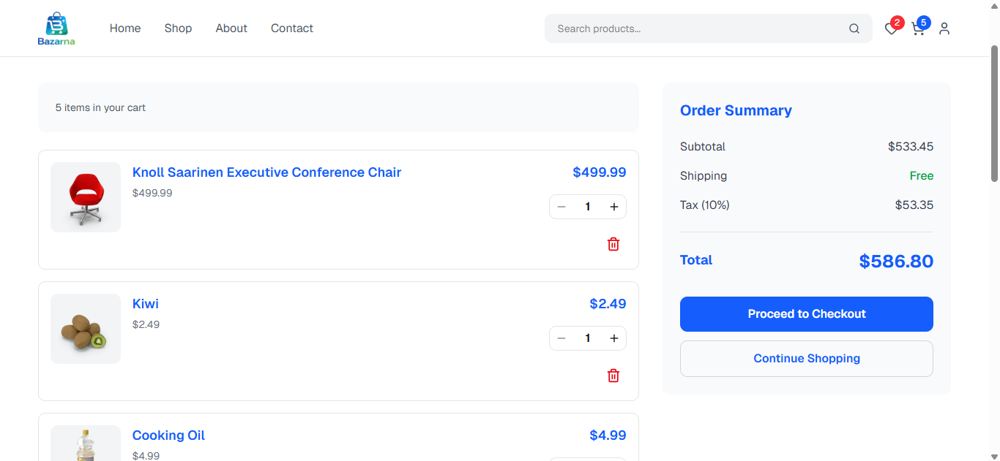

# Bazarna Store 🛒

Bazarna Store is a modern, responsive e-commerce website developed using **Next.js**, **TypeScript**, **Tailwind CSS**, **Lucide React**, and **Framer Motion**. This project demonstrates a complete e-commerce workflow with smooth animations, reusable components, and a clean, user-friendly interface.

---

## 📸 Website Preview

### 🏠 Home Page


### 🛍️ Shop Page


### 📦 Product Details


### 🛒 Cart Page


---

## 🌐 Pages

The website contains the following pages:

- **Home** – Landing page showcasing featured products and promotions.
- **Shop** – Browse products with filtering and search functionality.
- **Product Details** – Detailed product page with images, descriptions, and reviews.
- **Cart** – Manage items selected for purchase.
- **Wishlist** – Save your favorite products.
- **Checkout** – Complete your order securely.
- **Track Order** – Check the status of your orders.
- **FAQ** – Frequently asked questions.
- **Privacy Policy** – Website privacy information.
- **Terms and Conditions** – Legal terms for using the store.

---

## 🛠️ Technologies Used

- **Next.js** – React framework for server-side rendering and routing.
- **TypeScript** – Type safety and improved developer experience.
- **Tailwind CSS** – Utility-first CSS framework for fast and responsive styling.
- **Lucide React** – Beautiful, customizable icons.
- **Framer Motion** – Smooth animations and transitions for a modern feel.

---

## 🚀 Features

- Responsive and modern design.
- Smooth page and component animations using Framer Motion.
- Fully typed components with TypeScript.
- Dynamic product listing and detailed product pages.
- Cart and wishlist functionality.
- Secure checkout process.
- Order tracking page.
- SEO-friendly metadata and Open Graph tags.
- Clean and reusable components for scalability.
- Dynamic Metadata & SEO.

---

## ⚙️ Installation & Setup

Follow these steps to run the project locally:

### 1️⃣ Clone the repository
```bash
git clone https://github.com/ahmedtalaat-dev/bazarna-store.git
```

2️⃣ Navigate to the project folder
```bash
cd bazarna-store
```

3️⃣ Install dependencies
```bash
npm install
```

4️⃣ Run the development server
```bash
npm run dev
```

5️⃣ Open in browser
```bash
http://localhost:3000
```

---

## 🧑‍💻 Developer
Ahmed Talaat – Front-End Developer
